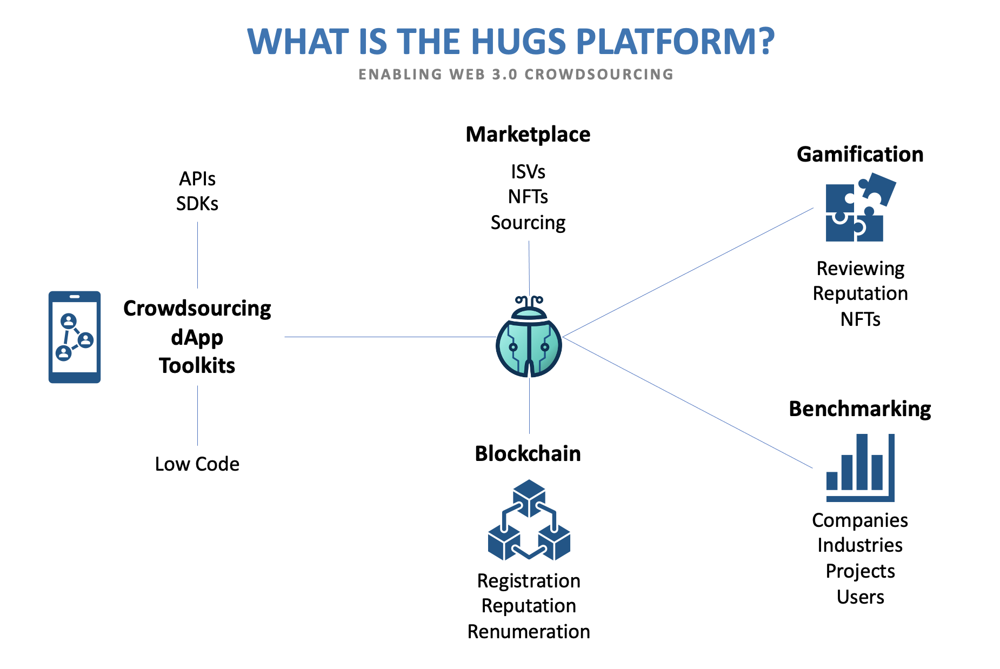

# The Hugs Platform

The Hugs Platform consists of several elements built with decentralised crowdsourcing in mind. The Platform lets these elements, each with their own unique features and characteristics, connect and communicate with each other. The Platform as a whole enables Web 3.0 crowdsourcing, empowers users, and rewards valuable contributions.

### The Hugs Platform elements

* [Hugs dApps](hugs-dapps.md)
* [Crowdsourcing Campaigns](crowdsourcing-campaigns.md)
* [Reviewer Consensus](broken-reference)
* [User Rewards](user-rewards.md)
* [Reputation Building](broken-reference)
* [Web 3.0 Affiliates](web-3.0-affiliates.md)

