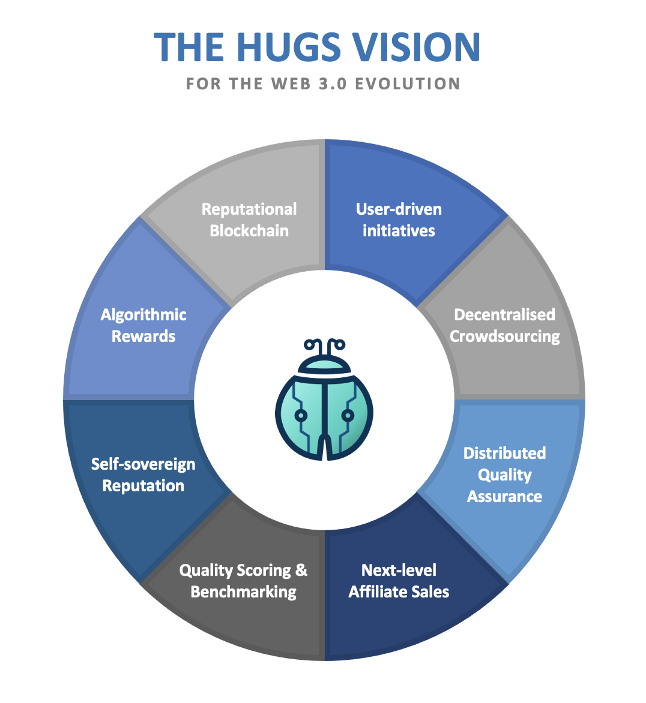

# The Vision

**The new era of crowdsourcing will consist of the following:**

* **User-driven Initiatives** - Every user will be able to do the following: build a crowdsourcing dApp, start a crowdsourcing campaign, join an existing campaign, review other contributions, access benchmarking scores, and check the reputation of others through chain analysis on the appropriate blockchain.
* **Decentralised Campaigns** - The results of a crowdsourcing campaign are stored in the blockchain and allow for users with various levels of expertise to join the campaign and make contributions.
* **Peer-to-peer Interactions** - Users (Contributors, Reviewers, Affiliates) should be able to interact with each other and with Clients without a trusted supplier in between, funnelling and filtering the user's feedback. dApps and blockchain will largely eliminate the need for (expensive) third parties.
* **Distributed Quality Assurance** - Every user can contribute to whatever he or she wants to contribute to, even if the owner of a product, process, or service was not reaching out to their users. A user's contribution is reviewed by independent, randomly assigned peers, safeguarding the quality of contributions.
* **Self-sovereign Reputation** - All stakeholders can build up a reputation linked to their public/private key pair. Reputation building can happen in an anonymous and immutable way, with a user's reputation safely stored in the blockchain. This will allow the user to control his own reputation, and let him sign transactions with others by using his reputational private key.
* **Quality Scoring** - Businesses, processes, organisations, governments, products, etc. can all receive a quality score once a user decides to start a campaign. This score will be stored in the Blockchain.
* **Benchmarking** - Quality Scores are available on-chain and can be queried by anyone. The available data will lead to decentralised benchmarking and leaderboards, based on unbiased user feedback.
* **Algorithmic Rewards** - In Web 3.0 crowdsourcing, every valuable contribution (= accepted by Reviewers), regardless of whether the contribution gets picked up by a client or by another party, should be rewarded with crypto tokens specifically reserved for this purpose.
* **Next-level Affiliate Sales** - When users take the initiative to start crowdsourcing campaigns, potential clients might not be aware of initiatives trying to improve their services. Decentralised Sales solves this problem by letting Affiliates contact potential Clients who have not yet bought into the campaign.
* **Immutable Data Storage** - Contributions, Reviews, Sales efforts, Reputation, and Quality Scores will all be registered in the blockchain to keep the data immutable, while the contents are stored off-chain to guarantee its privacy. This will also enable a self-sovereign reputation for all stakeholders.
* **Transferable Contributions** - All valuable Contributions will be stored as non-fungible tokens. These tokens will store unique data about the contribution. Thanks to the blockchain, ownership of a contribution can be transferred to another user.
* **Open Platform** - The Hugs Platform will be open, letting dApp builders deploy their crowdsourcing dApp in the Hugs ecosystem. The data processed and stored by the Hugs Platform will be objective by nature and kept to the absolute minimum. This will give dApp builders the necessary freedom to organise their dApp as they please.
* **The Traditional Approach** - Classic crowdsourcing campaigns, usually initiated by businesses, will still be possible. Instead of having to rely on a limited pool of people, they will now be able to tap into the wisdom of the entire world.

